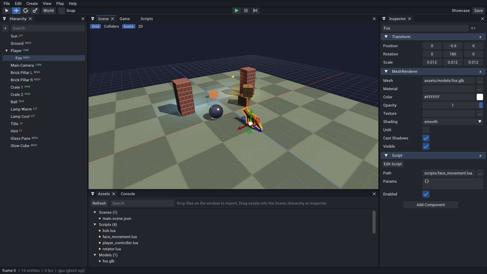
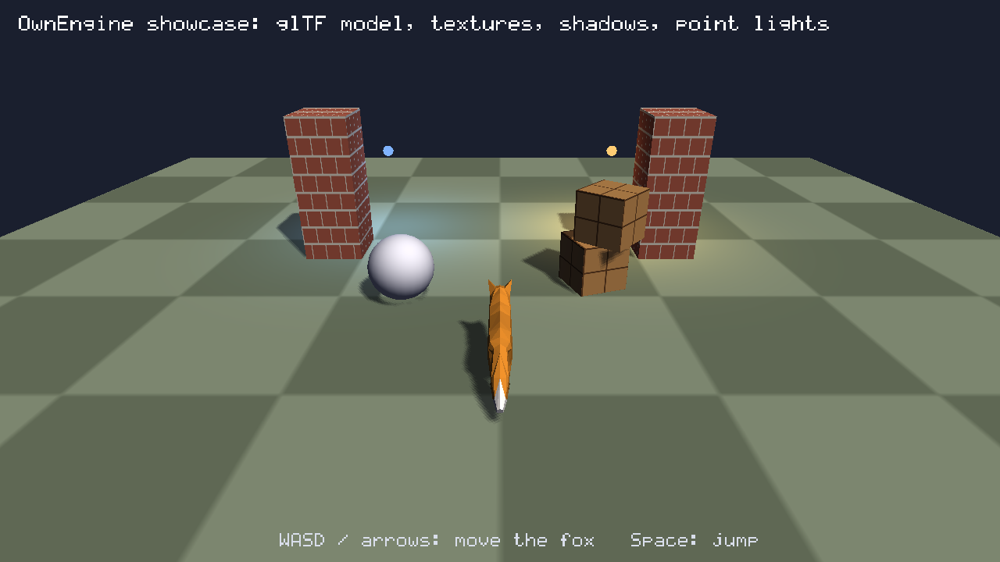

# OwnEngine

**한국어** | [English](README.en.md) | [日本語](README.ja.md)

AI가 쉽게 접근하고 검증할 수 있도록 설계한 C++17 게임 엔진입니다. 사람용 에디터와 AI용 인터페이스(CLI · HTTP · MCP)가 **같은 명령 API**를 공유합니다.



| 게임 화면 (`oe render samples/Showcase`) | |
|---|---|
|  | glTF 여우 캐릭터(플레이어 조작 + 팔로우 카메라), 절차 생성 텍스처, 그림자, 포인트 라이트. 결정적 소프트웨어 렌더러의 출력(`oe render`)이며, 게임 창·웹·에디터 뷰포트는 같은 장면을 GPU 렌더러로 그립니다. |

- 별도 설치할 의존성 없음 (MSVC + CMake만 필요, Lua·Jolt Physics·Box2D·sokol_gfx·stb·cgltf·Dear ImGui·ImGuizmo는 소스 동봉). 웹 런타임도 `runtime/web/`에 미리 빌드되어 포함 — 웹 배포에 Emscripten 불필요
- Windows(네이티브 창, `Name.exe` 패키징) · Web(WebAssembly + WebGL2, `oe package --web`) · Android(APK, `oe package --android` — [docs/ANDROID.md](docs/ANDROID.md)) · 헤드리스 지원. iOS / macOS / 콘솔은 플랫폼 계층만 추가하면 되도록 분리 — [docs/PLATFORMS.md](docs/PLATFORMS.md)
- 렌더러 두 개가 같은 장면을 그림: **GPU 렌더러**(sokol_gfx — Windows D3D11, Web WebGL2, Linux GLES3; 4× MSAA, 필터링된 그림자, 밉맵, 셰이더는 `engine/render/shaders/Shaders.glsl` 하나)는 게임 창·웹·에디터 뷰용, **소프트웨어 렌더러**(멀티스레드, 결정적)는 스크린샷 해시·테스트·피킹용
- 렌더링 기능: glTF 모델, PNG/JPEG 텍스처, 스무스/플랫 셰이딩, 포인트 라이트, 그림자, 직교/팔로우 카메라, 디버그 드로잉 — [docs/RENDERING.md](docs/RENDERING.md)
- 스켈레탈 애니메이션: glTF TRS·스킨, LINEAR/STEP/CUBICSPLINE, Animator·API·Lua 재생, 소프트웨어/GPU 스키닝(조인트 최대 64개). Showcase 여우는 정지/이동/Shift 달리기로 Survey/Walk/Run 전환 — [docs/ANIMATION.md](docs/ANIMATION.md)
- 파티클: 결정적 2D/3D 방출, 로컬/월드 공간, API·Lua burst, 두 렌더러의 카메라 빌보드, 수명에 따른 크기·색·투명도 변화와 시트 프레임. Platformer·Dungeon에 코인·피격 효과 적용 — [docs/PARTICLES.md](docs/PARTICLES.md)
- 머티리얼/PBR/반투명: metallic-roughness(GGX) 셰이딩, 노멀맵·AO·발광 텍스처, 반투명(뒤에서 앞으로 정렬)·마스크·양면, glTF 머티리얼 완전 로드, `.mat.json` 머티리얼 파일(`material.create`/`material.set`, 핫리로드) — [docs/RENDERING.md](docs/RENDERING.md)
- Jolt 기반 3D 물리와 Box2D 기반 2D 물리 (강체, 트리거, 캐릭터 컨트롤러, 원웨이 플랫폼·다각형·충돌 레이어, 결정적 시뮬레이션) — [docs/PHYSICS.md](docs/PHYSICS.md)
- 게임 UI: TrueType 폰트(한글 등 모든 언어, 폰트 파일 추가), 앵커·스트레치·부모-자식 배치, 레이아웃(세로/가로/그리드, 크기 맞춤), 리치 텍스트·줄바꿈·외곽선·그림자, 둥근 모서리·테두리 패널, 버튼 상태(호버/눌림/비활성), 이미지(9-slice, 채우기 바), 슬라이더/진행 바, 클리핑, 캔버스 스케일 — [docs/UI.md](docs/UI.md)
- 2D 게임: 스프라이트·스프라이트 시트 애니메이션(픽셀 아트, 투명 컷아웃), 텍스트로 쓰는 타일맵(타일셋 파일, 자동 연결 16/47 패턴, 변형 타일, 슬로프·원웨이 등 타일별 충돌), Box2D 2D 물리, 경계 있는 카메라 추적, 에디터 2D 뷰와 타일 브러시 — [docs/2D.md](docs/2D.md)
- 게임 구성 요소: 프리팹, 씬 전환 + 게임 데이터, 메시지/타이머, 게임 내 UI, 오디오(결정적 믹서, 효과음 생성) — [docs/GAMEPLAY.md](docs/GAMEPLAY.md)
- Lua 5.4 스크립팅 (샌드박스, 핫리로드, 에러에 파일:줄 표시) — [docs/SCRIPTING.md](docs/SCRIPTING.md)
- 카메라 후처리: 소프트웨어·GPU 노출·HDR Reinhard 톤매핑·블룸·비네트·FXAA 지원, UI와 선택 윤곽선 유지. Showcase 1~6 키로 Off·톤매핑·블룸·비네트·FXAA·전체 효과 선택. `shader.create`·`shader.check`로 셰이더 그래프 생성·검증 가능. 재질 셰이더 그래프의 CPU·GPU 기본 픽셀 실행 지원. 그래프 알파의 그림자·선택 처리 지원. 추가 GPU 연산·패키징 검증은 진행 중 — [docs/POSTPROCESS.md](docs/POSTPROCESS.md)
- 게임패드 입력: 축 6개 API 주입과 Lua `input.axis`, 공통 0.15 데드존, Windows XInput·웹 Gamepad API·Android 매핑, 에디터 Game 뷰와 Platformer/Dungeon 조작. 실제 컨트롤러 검증은 남음 — [docs/INPUT.md](docs/INPUT.md)
- 웹 멀티터치: Lua `input.touches()`에 모든 손가락 전달, 화면 버튼 동시 조작, 첫 손가락 마우스 호환. 브라우저 합성 이벤트 검증 완료, 모바일 실기기 검증은 남음 — [docs/TOUCH.md](docs/TOUCH.md)
- 결정적(deterministic) 시뮬레이션과 소프트웨어 렌더러: 같은 입력이면 같은 프레임 해시 → AI가 테스트 오라클로 사용 가능

## 빌드

```bat
build.bat
build\bin\oe_tests.exe
```

Visual Studio 2022(“C++를 사용한 데스크톱 개발”)만 있으면 됩니다. CMake/Ninja는 VS에 포함된 것을 자동으로 사용합니다.

웹 런타임(`oe package --web`용)은 `runtime/web/`에 미리 빌드되어 들어 있어 따로 준비할 것이 없습니다. 엔진 C++을 고친 뒤 웹 빌드에도 반영하려면 [Emscripten SDK](https://emscripten.org/docs/getting_started/downloads.html)를 설치하고 `set EMSDK=C:\path\to\emsdk` 후 `build_web.bat` (Linux/macOS: `./build_web.sh`) — 결과가 `build\bin\web\`와 `runtime\web\`에 들어가니 함께 커밋하세요.

## 사용법

```bat
build\bin\oe.exe new MyGame                 :: 2스테이지 코인 수집 샘플 게임 프로젝트 생성
build\bin\oe.exe editor MyGame              :: 에디터 (에이전트용 API도 http://127.0.0.1:7777 에서 동시 제공)
build\bin\oe.exe editor MyGame --lang ja    :: 에디터 언어 지정 (ko / en / ja, 기본은 OS 언어)
build\bin\oe.exe run MyGame                 :: 네이티브 창에서 플레이 (WASD / Space)
build\bin\oe.exe render MyGame --out shot.png --frames 60
build\bin\oe.exe exec MyGame scene.summary
build\bin\oe.exe exec MyGame entity.create "{\"name\":\"Box\",\"components\":{\"MeshRenderer\":{\"color\":\"#ff8800\"}}}" --save
build\bin\oe.exe import MyGame model.glb     :: 외부 모델/텍스처/사운드를 프로젝트로 복사
build\bin\oe.exe package MyGame             :: 배포용 폴더 dist\MyGame\ 생성 (MyGame.exe + game\)
build\bin\oe.exe package MyGame --web       :: 웹 배포 폴더 dist\MyGame-web\ (index.html + wasm, 정적 호스팅 어디든)
build\bin\oe.exe serve dist\MyGame-web      :: 웹 빌드를 로컬에서 실행 (http://127.0.0.1:8080)
build\bin\oe.exe package MyGame --android   :: 안드로이드 APK dist\MyGame-android\MyGame.apk (NDK 불필요; SDK build-tools + Java 필요, --install 로 폰에 설치)
build\bin\oe.exe api --markdown             :: 명령 레퍼런스 출력
```

## 에디터

네트워크 로비/RPC: `project.json`에
`"network":{"mode":"lockstep","transport":"tcp","port":7778}`을 설정한 뒤,
계속 실행되는 도구 세션이나 Lua에서 `net.host`/`net.join`을 호출합니다.
`net.players`, `net.ready`, `net.stats`, `net.rpc`, `net.on`으로 로비와 메시지를 처리합니다.
설정이 없거나 `none`이면 기존 단일 플레이와 로컬 RPC로 동작합니다.
network.actions/axes 선언 후 모두 준비되면 net.start로 락스텝을 시작합니다.
input.player(id), 비동기화 보고, 실험적 이력 재실행 롤백을 지원합니다. 빠른 네이티브
네이티브 롤백(M5c)과 권위 서버 복제(M6) 구현 완료: NetSync/NetPlayer, 델타, 보간, 소유자 예측 지원. 웹 클라이언트는 호환 WebSocket 서버와
재빌드한 런타임이 필요합니다. [docs/NETWORK.md](docs/NETWORK.md) 참고.

`oe editor`는 **에디터**(Dear ImGui 도킹 + ImGuizmo, 엔진과 같은 프로세스에서 GPU로 그림)를 엽니다. 명령 API만 쓰므로 에이전트(`oe mcp --connect 7777`)가 사람과 같은 세션을 동시에 다룹니다. 창이 없는 환경(Linux 헤드리스 등)에서는 `oe editor MyGame --screenshot shot.png`로 에디터 화면을 렌더링할 수 있습니다. 자세한 내용: [docs/EDITOR.md](docs/EDITOR.md)

- 도킹 패널: Hierarchy · Inspector · Scene · Game · Assets · Console · Scripts — 배치는 프로젝트별로 저장(`.oe/editor.ini`), 보기 > 레이아웃 초기화
- Scene 뷰: 우클릭 드래그 + WASD/QE 비행, 가운데 버튼 팬, Alt+좌클릭 궤도, 휠 줌, 클릭 선택, **이동/회전/스케일 기즈모**(Q/W/E/R, 로컬/월드, 스냅), 카메라·라이트 아이콘, 콜라이더 표시, 2D 뷰, 타일 칠하기(Tiles 패널), 에셋 드래그로 배치
- Game 뷰: 클릭하면 키보드·마우스가 게임으로(마우스 잠금 게임은 원시 마우스 이동, Esc로 해제), 화면비 고정(16:9 등)
- Hierarchy: 다중 선택(Ctrl/Shift), 드래그로 부모 변경, 우클릭 메뉴(이름 변경, 복제, 삭제, 자식 생성, 프리팹으로 저장)
- Inspector: 리플렉션으로 자동 생성, 드래그 한 번 = Undo 한 단계, 에셋 필드는 선택 목록 + 드래그 앤 드롭
- Assets: 더블클릭으로 씬 열기 / 스크립트 편집 / 프리팹 배치, 탐색기에서 파일을 창에 끌어다 놓으면 가져오기
- Scripts: Lua 코드 편집기 — 구문 강조, 줄 번호, 찾기/바꾸기/모두 바꾸기(Ctrl+F), 입력하는 동안 문법 오류·전역 변수 실수 표시(줄 마커 + 밑줄 + 문제 목록), 실행 오류 표시, Ctrl+S 저장 → 핫리로드
- Inspector의 Script Params: 스크립트에서 읽는 값을 자동으로 찾아 타입별 필드(숫자·체크박스·선택지·벡터·색상·씬 선택)로 표시, 기본값은 흐리게, 초기화 버튼, 스크립트가 쓰지 않는 키 경고
- Console: 로그 필터 + 명령 입력(Tab 자동완성)
- AI가 API로 바꾼 내용이 알림과 계층의 표시로 실시간 반영, 저장 안 한 변경은 닫기/씬 전환 때 확인
- 인터페이스 언어: 한국어 · English · 日本語 (OS 언어로 자동 선택, 보기 > 언어 또는 `--lang ko|en|ja`), 한글·일본어 입력/표시(시스템 폰트 자동 병합, IME), 고해상도(DPI) 대응, 인터페이스 크기 조절
- 단축키: Ctrl+S 저장, Ctrl+Z/Y 되돌리기, Ctrl+D 복제, Del 삭제, F 포커스, F2 이름 변경, Ctrl+P 플레이/정지
- 에이전트용 에디터 스크린샷: `oe editor MyGame --screenshot shot.png [--select Player] [--play --frames 60]`


전용 서버: `oe serve-game <project> --min-players 1` 또는 패키지 `Game.exe --server` (창/GPU/오디오 장치 없이 실행). TCP/UDP 및 네이티브 WebSocket 서버 지원. 에디터 Players 선택으로 최대 8명 Loopback 테스트, Game Player 선택으로 피어별 입력, Network 패널에서 지연/통계 확인. 명령: `net.spawn_local_peers`, `net.peer_call`, `net.local_peers`, `net.simulate`. 자세한 사용법·플랫폼 검증 범위: [docs/NETWORK.md](docs/NETWORK.md).

Network 창은 `보기 > 네트워크`에서 열 수 있습니다. 네트워크 미설정 프로젝트에도 설정 안내가 표시되며, 이전 에디터 레이아웃은 새 탭을 자동으로 추가합니다.

## AI 연동

Lua `save.get/set/delete/flush` 또는 `save.*` 명령으로 진행 상황을 저장합니다.
도구 세션은 기본적으로 메모리를 사용하며, `--save-dir <dir>`로 JSON 슬롯을
영구 저장할 수 있습니다. 자세한 내용: [docs/SAVE.md](docs/SAVE.md).

| 방식 | 명령 |
|---|---|
| MCP (Claude Code 등) | `oe mcp <project> [--port 7777]` — 모든 명령이 MCP 도구, 스크린샷은 이미지로 반환. `--port`를 주면 사람이 같은 세션을 에디터로 봄 |
| 실행 중인 에디터에 붙기 | `oe mcp --connect 7777` |
| CLI / 스크립트 | `oe exec`, `oe script` (JSON 입출력, 실패 시 exit code 1) |
| HTTP | `POST /api/call {"command": "...", "args": {...}}` |

이 저장소의 [.mcp.json](.mcp.json)은 Claude Code에서 `samples/Hello` 프로젝트를 MCP 서버로 연결합니다 (먼저 빌드 필요). 에이전트용 작업 가이드는 [CLAUDE.md](CLAUDE.md) / [AGENTS.md](AGENTS.md), 전체 API는 [docs/API.md](docs/API.md), 구조는 [docs/ARCHITECTURE.md](docs/ARCHITECTURE.md), 코드를 고칠 때 지킬 설계 방침(사람·AI 에이전트 공통)은 [docs/DESIGN.md](docs/DESIGN.md)에 있습니다.

## 구조

```
engine/core      Json, Math, Log, PNG, FileSystem
engine/scene     리플렉션, 컴포넌트, Scene, 시스템
engine/script    Lua 스크립트 호스트 (ScriptHost)
engine/physics   물리 (Jolt 래퍼 PhysicsWorld, Box2D 래퍼 Physics2D)
engine/audio     오디오 믹서, WAV, 효과음 생성기
engine/assets    에셋 관리, glTF/이미지 로딩
engine/render    IRenderer, 소프트웨어 래스터라이저, GPU 렌더러(sokol_gfx) + 셰이더, 메시, 게임 UI
engine/api       명령 레지스트리, HTTP 서버, 에디터 라우트, MCP 서버
engine/app       Engine (시뮬레이션, undo, 작업 큐), 프로젝트 템플릿
engine/editor    네이티브 에디터 (Dear ImGui 패널, 기즈모, Scene/Game 뷰)
engine/platform  Platform.h + win32(D3D11) / web(WebGL2) / android(GLES3) / null(EGL) 구현
tools/oe         CLI
tools/player     게임 런타임 (Name.exe / 웹 wasm / 안드로이드 .so) + 웹 페이지 템플릿
tools/shaders    셰이더 재생성 스크립트 (sokol-shdc)
tests/           자체 테스트
third_party/lua  Lua 5.4.8 (MIT)
third_party/jolt Jolt Physics 5.6.0 (MIT)
third_party/box2d Box2D 3.1.1 (MIT)
third_party/stb, cgltf  이미지 디코더·인코더, glTF 디코더 (PD/MIT, MIT)
third_party/sokol  sokol_gfx + sokol_imgui (zlib) — D3D11 / WebGL2 / GLES3 추상화
third_party/imgui, imguizmo, imguicolortextedit  Dear ImGui 1.92.9b docking, ImGuizmo, ImGuiColorTextEdit (MIT) — 네이티브 에디터 전용
templates/       `oe new` 프로젝트 템플릿
samples/Hello    샘플 프로젝트 (템플릿으로 생성)
samples/Showcase 렌더링 샘플 (glTF 여우 캐릭터, 텍스처, 그림자, 포인트 라이트)
samples/Dungeon  2D 탑뷰 액션 (Box2D, 자동 연결 타일셋, 밀 수 있는 상자, 마법탄, 슬라임)
samples/Platformer 2D 횡스크롤 플랫포머 (텍스트 타일맵, 스프라이트 애니메이션, 적, ? 블록, 패럴랙스)
samples/FPS      1인칭 슈팅 테스트 게임 (마우스 시점, 히트스캔 권총, 재장전, 움직이는 표적, 결과 화면)
```

네트워크 샘플: `samples/NetCoop`(lockstep 협동), `samples/NetDuel`(rollback 대전), `samples/NetArena`(서버 권한 대전). 에디터 Players 2로 즉시 실행하거나 게임 내 Host/Join/Ready/Start 버튼 사용. WASD·게임패드·터치 버튼 지원. 실행·WebSocket·Android 검증 가이드: [docs/NETWORK_SAMPLES.md](docs/NETWORK_SAMPLES.md).
